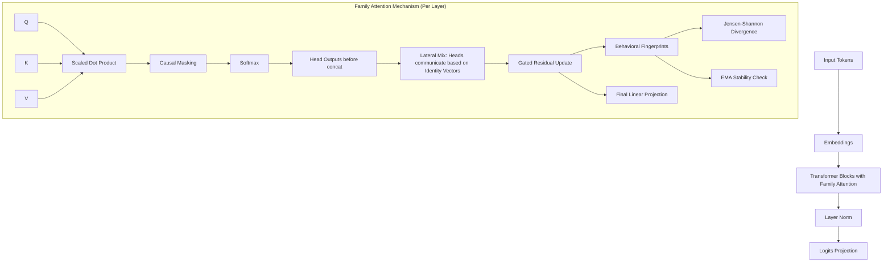

# FamilyAttn NanoGPT 🧬

An advanced, highly-optimized NanoGPT implementation featuring a novel **Family Attention** mechanism. Family Attention enhances standard multi-head causal attention by introducing inter-head lateral communication, distinct "identity vectors" for each head, behavioral fingerprints, EMA-based stability buffers, and a vectorised Jensen-Shannon divergence loss to explicitly encourage head diversity.

## Architecture

FamilyAttn transforms the traditional self-attention mechanism by adding collaborative structures between attention heads, ensuring diverse representation learning.



### Key Components of Family Attention:
1. **Identity Vectors**: Learnable, L2-normalized vectors assigned to each attention head.
2. **Lateral Mix**: Attention heads communicate and mix representations laterally based on the similarity of their identity vectors.
3. **Behavioral Fingerprints**: A projection of each head's output used to measure head behavior.
4. **JS Divergence Loss**: Vectorized Jensen-Shannon divergence explicitly penalizes heads that behave too similarly.
5. **EMA Stability**: An Exponential Moving Average buffer that regularizes and stabilizes the behavioral fingerprints during training.

## Training Optimizations

This repository is built for **maximum throughput** on limited hardware (e.g., local GPUs like GTX 1650 Ti / RTX 30/40 series).

- **`MemmapDataset`**: Ultra-fast zero-copy binary streaming from disk. Bypasses CPU bottleneck and allows instant-seek random access.
- **Mixed-Precision Training**: Automatic Mixed Precision (AMP) with `float16` and `bfloat16` (Ampere+) support.
- **Efficient Scaling**: Gradient accumulation, gradient clipping, AdamW optimizer, and Cosine LR schedule with warmup.
- **Hardware Agnostic**: Automatic fallback to eager execution on Windows (where `torch.compile` Triton backend is unavailable).

## Setup & Guide

### 1. Data Preparation
Convert your text CSV datasets (like TinyStories) into dense `uint16` binary files for streaming.

```bash
python prepare_data.py
```

### 2. Training the Model
Train the model. The script automatically handles checkpointing, learning rate scheduling, and validation.

```bash
python train.py --batch_size 32 --max_steps 50000 --device cuda
```
Logs are saved in JSONL format, allowing for real-time visualization.

### 3. Web Dashboard UI
Launch the beautiful, glassmorphism-styled web dashboard to track training metrics (Loss, Divergence, Stability, Learning Rate) in real-time, or generate text from the model.

```bash
uvicorn api:app --reload --port 8000
```
Then open your browser to `http://localhost:8000`.

### 4. Generation
Generate text manually using the command line:
```bash
python generate.py
```

---
*Created as part of the advanced agentic coding framework for localized GPU training on TinyStories.*
